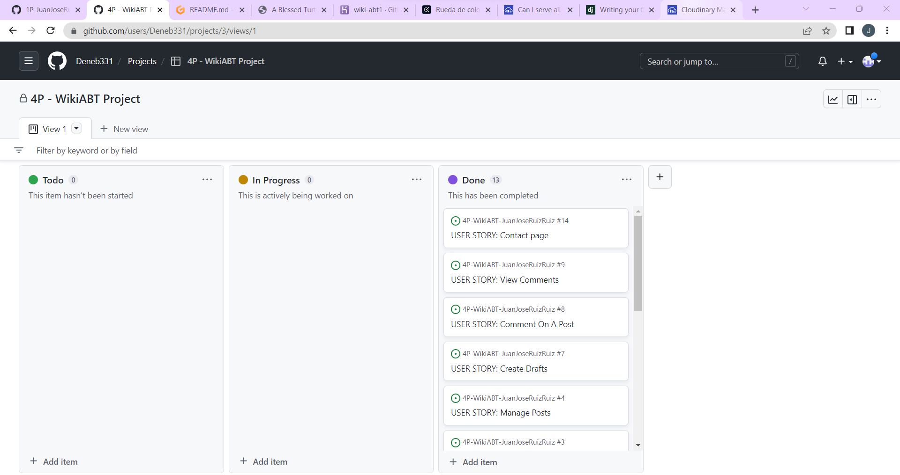

<h1 align="center">4P Juan Jose Ruiz Ruiz - A Blessed Turtle Game Studio Wiki</h1>

[View the live project here.](https://wiki-abt1.herokuapp.com/)

This page is a wiki where a fictional game studio organise information of their games, and is available to the general public so players can learn more about the worlds created by this studio.

<h2 align="center"></h2>

## User Experience (UX)

-   ### User stories

    All the user stories where created in Github issues, organised in different columns depending if they were to do, in progress or completed.

    <h2 align="center"></h2>

    - View Category List: As a Site User I can view a list of the categories so that I can find easier a post about the topic I am looking for

    - Post Categories: As a Admin I can assign categories to a post so that I can keep the content organized

    - Create/Edit Post: As a Site User I can create a new post or edit an existing one so that I can update the wiki with new info

    - Delete Post: As a Post author I can delete posts so that I can have control over the content I create.

    - Manage Posts: As a Site Admin I can validate posts or comments made by other site users so that I can manage the wiki content

    - View Paginated Posts: As a Site User I can view a list of posts so that I can find and view the post I want easily

    - Open Posts: As a Site User I can open a post so that I can view the content in that post

    - Create Drafts: As a Site User I can create draft posts so that I can finish the post later

    - Comment on a Post: As a Site User I can comment on a post so that I can have a conversation with other users

    - View Comments: As a Site User I can view the comments in a post so that I can read the conversation

    - Like / Unlike: As a Site User I can like or unlike posts or comments so that I can interact with the content

    - View Likes: As a Site User I can view likes on posts or comments so that I can see which posts or comments have more popularity

    - Authentication: As a Site User I can log in into my own account so that I can comment, write new posts or edit existing posts.

    - Permissions: As a Site User my posts have access restriction so that they are protected from other users.

    - Contact Page: As a Site User I can fill a contact form so that I can send feedback to the site admin

-   ### Design
    -   #### Color Scheme
        -   The colors chosen are a combination of dark and light blue and green, chosen for being cold and chill colors:
        <h2 align="center"></h2>

## Features

-   Responsive on all device sizes

-   Category organised posts that can be edited by the user

-   Comment section in posts

-   Like/dislike posts

-   Contact form with input validation

-   Authentication system

## Technologies Used

### Languages Used

-   [HTML5](https://en.wikipedia.org/wiki/HTML5)
-   [CSS3](https://en.wikipedia.org/wiki/Cascading_Style_Sheets)
-   [JS](https://en.wikipedia.org/wiki/JavaScript)
-   [Python](https://en.wikipedia.org/wiki/Python_(programming_language))

### Frameworks, Libraries & Programs Used

1. [Hover.css:](https://ianlunn.github.io/Hover/)
    - Hover.css was used on the the start and send email buttons to show the user easily where he/she can interact.
1. [Git](https://git-scm.com/)
    - Git was used for version control by utilizing the Gitpod terminal to commit to Git and Push to GitHub.
1. [GitHub:](https://github.com/)
    - GitHub is used to store the projects code after being pushed from Git.
1. [Django:](https://www.djangoproject.com/)
    - Django is the framework used to build the whole site.
1. [Bootstrap5:](https://getbootstrap.com/)
    - Bootstrap has been used for the structure and style of the project.
1. [Heroku:](https://www.heroku.com/)
    - Heroku is the platform used to host the site.
1. [Cloudinary:](https://cloudinary.com/)
    - Cloudinary is used to manage the images in the site.
1. [ElephantSQL:](https://www.elephantsql.com/)
    - ElephantSQL is used to create and host the database for the site.
1. [Adobe Color Wheel:](https://color.adobe.com/es/create/color-wheel)
    - Adobe Color Wheel was used to create the color palette for the website.
1. [Summernote:](https://summernote.org/)
    - Summernote was used in the text fields where the user needed more styling text tools.
1. [Crispy Forms:](https://django-crispy-forms.readthedocs.io/en/latest/)
    - Crispy Forms was used in the comment section to give it better styling.

## Testing

The W3C Markup Validator and W3C CSS Validator Services were used to validate every page of the project to ensure there were no syntax errors in the project.

-   [W3C HTML Markup Validator](https://jigsaw.w3.org/css-validator/#validate_by_input)
    - The base page has errors due to the custom links used in Django, but other than that, there's no errors.
    - index.html has no errors.
    - category_list.html has no errors.
    - post_list.html has no errors.
    - post_detail.html has no errors.
    - edit_post.html has no errors.
    - create_post.html has no errors.
    - contact.html has no errors.
    - login.html has no errors.
    - logout.html has no errors.
    - signup.html has no errors.

-   [W3C CSS Validator](https://jigsaw.w3.org/css-validator/#validate_by_input)
        <h2 align="center"></h2>
-   [JSHint](https://jshint.com/)
        <h2 align="center"></h2>
-   [PythonChecker](https://www.pythonchecker.com/)
    - admin.py has no errors.
    - forms.py has no errors.
    - models.py has no errors.
    - urls.py has no errors.
    - views.py has no errors.
    - settings.py has no errors.
    - test_forms.py has no errors.
    - test_models.py has no errors.
    - test_views.py has no errors.

### Testing User Stories from User Experience (UX) Section

- View Category List: The user can access the Category List by clicking in the option Explore in the navbar.

- Post Categories: The admin can create or delete categories from de Admin Panel.

- Create/Edit Post: If the user is authenticated, he/she can create a new post by clicking in the green "Create Post" button in the navbar, or edit a post from the post list of its category.

- Manage Posts: The admin can manage the posts from the admin panel.

- View Paginated Posts: When the user clicks on a category, he will see a list of all the posts with that category assigned.

- Open Posts: The user can open any post he finds in the post list inside each category.

- Create Drafts: When a post is created, the user or admin have an option to decide if the post is on draft or fully published.

- Comment on a Post: The user can comment on any post with the comment box he/she can find at the bottom of the individual post.

- View Comments: The user can visualize all the comments in a post at the bottom of the post page.

- Like / Unlike: The user can like or dislike a post by clicking on the heart next to the post title.

- View Likes: The user can see if he liked or not the post depending on the icon he/she sees next to the post title.

- Authentication: The user have the log in and register pages in the navbar when he/she is not authenticated, and he will see the option to log out when he is authenticated.

- Contact Page: The user can access the contact form by clicking in the contact option in the navbar.

### Further Testing

-   The Website was tested on Google Chrome, Microsoft Edge and Opera browsers.
-   The website was viewed on a variety of devices such as Laptop and Xiaomi Redmi Note 10.
-   Tests have been written to test forms, views and models.
-   A large amount of testing was done to ensure that all pages were linking correctly.
-   Friends were asked to review the site and documentation to point out any bugs and/or user experience issues.

### Bug Log

- When tests are executed, the console is not able to create a testing database to check the tests - Changed Debug in settings to "'DEVELOPMENT' in os.environ" and add an if statement in settings to use one database or other depending if we are in depelopment or not
- In the deployed project, style.css is not loading - Used the command "pyhton3 manage.py collectstatic"
- When try to access a post, the page can't load because it can't find the correct slug - Use get_absolute_url() method in the post model.
- Even when the view and url seems to be right, contact page can't load - Change the order of the contact url in urls.py
- In the contact form, it gives an error when the user try to use it to send a message - needed to create an application password in the gmail and update settings.py
- In deployment, summernote widget doesn't show up as it does in local environment - Couldn't find a solution
- Background images in index page don't load in Debug=False, even when they are uploaded in Cloudinary and did collectstatic command - Couldn't find a solution

## Deployment

The project was deployed to Heroku using the following steps...

### ElephantSQL
- Register/Log in and create a new database. Choose the region that is closest to you.
- After creating the database, save the database url, as you will need it later in Django.

### Cloudinary
- Register/Log in, and you will get a Cloudinary url that you need to save for later in Django.

### Django:
- Create the file env.py and save the DATABASE_URL and CLOUDINARY_URL we got before.
- Execute the command 'pip3 freeze --local > requirements.txt' to save all heroku needs to install later.
- In the settings.py, change Debug to False.
- Create Procfile file in the root of your project, and write "web: gunicorn PROJ_NAME.wsgi"
- In settings.py, change ALLOWED_HOSTS to this: ALLOWED_HOSTS = ["HEROKUAPPNAME.herokuapp.com", "localhost"]
- Push all the changes to the server.

### Heroku
- Log in to Heroku and create a new app by clicking on the button in the top-right corner.
- Use a unique name for the app and choose your region (mine was Europe) and click on Create App
- In Settings, click on Reveal Config Vars and add the following:
    - SECRET_KEY: Create your personal secret key.
    - CLOUDINARY_URL: You can get it from Cloudinary website just after login in
    - DATABASE_URL: You can get it from ElephantSQL after login in and create de database for this project.
    - CONTACT_EMAIL: Email used in your contact form.
    - EMAIL_PASS: App password created in your gmail account. 
- Go to Deploy tab and connect your github account.
- Connect your repository to Heroku.
- Choose 'main' branch and click Deploy Branch.

## Credits

### Code

-   The main references used to build this website are the 'I think therefore I blog' CI project for Django references, [Writing your first Django app](https://docs.djangoproject.com/en/4.1/intro/tutorial01/), and the rest of Django documentation.

-   [Django Documentation](https://docs.djangoproject.com/en/4.1/) :  for research about forms, email features and help understanding Django workflow.

-   [W3Schools](https://www.w3schools.com/) : For research about CSS features.

-   [Stack Overflow](https://stackoverflow.com/) : For research about errors and dead-end situations.

### Content

-   All content was written by the developer, based in the projects and templates given by Code Institute, tutorship, resources found in documentation and Stack Overflow and my mentor help.

### Media

-   [Pixabay](https://pixabay.com/)

### Acknowledgements

-   My Mentor for continuous helpful feedback and resources.
-   Code Institute Tutorship for help when needed.
-   The Slack community for the instant help whenever I needed it.